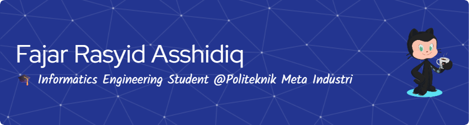

## Hallow word !, I'm Fajar Rasyid Asshiddiq 👋

<!--
**fajarRA526/fajarRA526** is a ✨ _special_ ✨ repository because its `README.md` (this file) appears on your GitHub profile.

Here are some ideas to get you started:

- 🔭 I’m currently working on ...
- 🌱 I’m currently learning ...
- 👯 I’m looking to collaborate on ...
- 🤔 I’m looking for help with ...
- 💬 Ask me about ...
- 📫 How to reach me: ...
- 😄 Pronouns: ...
- ⚡ Fun fact: ...
-->
- 🔭 Currently I am a student at **Meta Polytechnic**
- 🌱 I’m currently learning **Laravel** Framework
- 🤗🤗🤗🤗🤗🤗🤗

  
  

##### Skills 

##### Connect With Me
 

##### My Github States

